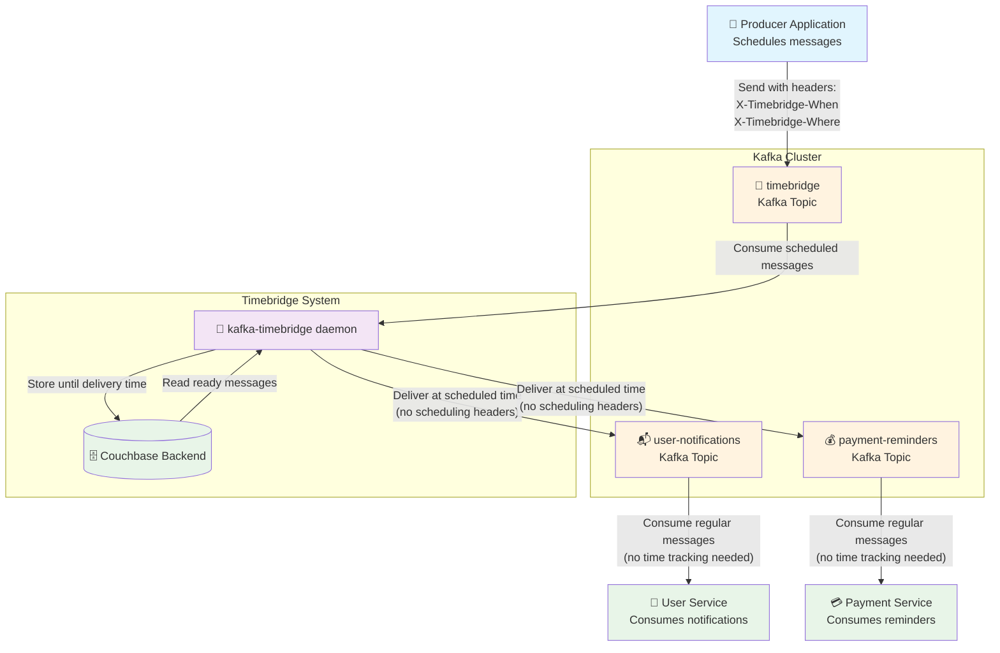

# Kafka Timebridge

A lightweight, production-ready daemon for scheduling delayed Kafka message delivery. Send messages now, deliver them later - from minutes to months in advance.

> **🚀 Quick Start**: `docker run --rm ghcr.io/martavoi/kafka-timebridge:latest` - [See installation guide](#installation)

## About

Kafka Timebridge enables sophisticated delayed message scheduling in Kafka environments. Instead of sending messages directly to destination topics, clients send them to a timebridge topic with scheduling metadata. The daemon stores messages in configurable backends and delivers them to their destination topics at the specified time.

**Key Features:**
- ⏰ Schedule message delivery from minutes to months in advance
- 🗄️ Multiple storage backends: in-memory (default) and Couchbase
- 🔧 Simple header-based scheduling interface
- ⚙️ Configurable via environment variables and CLI flags
- 🔒 SASL authentication support for secure Kafka clusters
- 📊 Structured logging with configurable levels and formats
- 🐳 **Ready-to-use Docker images** - just `docker run ghcr.io/martavoi/kafka-timebridge:latest`
- 🔄 Graceful shutdown and error handling with exponential backoff

**Use Cases:**
- Payment reminders and notifications
- Subscription renewals and expiration alerts
- Follow-up emails and marketing campaigns
- System maintenance notifications
- Any time-delayed workflow automation

## How It Works



### Process Flow

1. **Send**: Client sends message to timebridge topic (default: `timebridge`) with headers:
   - `X-Timebridge-When`: When to deliver (RFC3339 format, e.g., `2024-12-25T10:00:00Z`)
   - `X-Timebridge-Where`: Target topic for delivery (e.g., `user-notifications`)

2. **Store**: Timebridge daemon stores the message in configured backend until delivery time

3. **Deliver**: At specified time, message is sent to destination topic

### Message Headers

| Header | Required | Format | Example |
|--------|----------|---------|---------|
| `X-Timebridge-When` | Yes | RFC3339 timestamp | `2024-12-25T10:00:00Z` |
| `X-Timebridge-Where` | Yes | Destination topic name | `user-notifications` |

### Programmatic Example

```go
// Example using confluent-kafka-go
producer.Produce(&kafka.Message{
    TopicPartition: kafka.TopicPartition{Topic: &topic, Partition: kafka.PartitionAny},
    Headers: []kafka.Header{
        {Key: "X-Timebridge-When", Value: []byte("2024-12-25T10:00:00Z")},
        {Key: "X-Timebridge-Where", Value: []byte("user-notifications")},
        {Key: "Content-Type", Value: []byte("application/json")},
    },
    Value: []byte(`{"userId": 123, "message": "Scheduled notification"}`),
}, nil)
```

## Storage Backends

### In-Memory Backend (Default)
- **Purpose**: Development, testing, and simple use cases
- **Pros**: Zero configuration, instant startup
- **Cons**: Messages lost on restart, limited by available RAM
- **Configuration**: No additional setup required

### Couchbase Backend (Recommended for Production)
- **Purpose**: Production deployments requiring persistence and reliability
- **Pros**: Persistent storage, scalable, high availability
- **Cons**: Requires Couchbase cluster setup
- **Configuration**: See Couchbase settings below

## Installation

### 🐳 Docker (Recommended)

The easiest way to run kafka-timebridge is using Docker. Images are automatically built and published to GitHub Container Registry with each release.

#### Quick Start
```bash
# Pull and run the latest version
docker run --rm ghcr.io/martavoi/kafka-timebridge:latest

# Run with custom Kafka configuration
docker run --rm \
  -e KAFKA_BROKERS=your-kafka:9092 \
  -e KAFKA_TOPIC=timebridge \
  -e BACKEND=memory \
  ghcr.io/martavoi/kafka-timebridge:latest

# Run a specific version
docker run --rm ghcr.io/martavoi/kafka-timebridge:v1.2.3
```

#### Docker Compose Example
```yaml
version: '3.8'
services:
  kafka-timebridge:
    image: ghcr.io/martavoi/kafka-timebridge:latest
    environment:
      - KAFKA_BROKERS=kafka:9092
      - KAFKA_TOPIC=timebridge
      - BACKEND=memory
      - LOG_LEVEL=info
      - LOG_FORMAT=json
    restart: unless-stopped
    depends_on:
      - kafka
```

#### Available Tags
- `latest` - Latest stable release
- `v1.2.3` - Specific version tags
- All images are based on Alpine Linux for minimal size (~15MB)

### 📦 Binary Releases

Pre-compiled binaries are available for Linux AMD64:

1. **Download** from [GitHub Releases](https://github.com/martavoi/kafka-timebridge/releases)
2. **Extract**: `tar -xzf kafka-timebridge-linux-amd64.tar.gz`
3. **Run**: `./kafka-timebridge-linux-amd64`

### 🔧 Build from Source

```bash
# Clone the repository
git clone https://github.com/martavoi/kafka-timebridge.git
cd kafka-timebridge

# Build (requires Go 1.24+ and CGO enabled)
CGO_ENABLED=1 go build -o kafka-timebridge ./cmd

# Run
./kafka-timebridge
```

## CLI Usage

kafka-timebridge provides a simple command-line interface with the following commands:

```bash
# Start the timebridge daemon (default behavior)
kafka-timebridge

# Display version information
kafka-timebridge version

# Show help and available commands
kafka-timebridge help
```

### Examples

```bash
# Start with default configuration
kafka-timebridge

# Check the version
$ kafka-timebridge version
kafka-timebridge version v1.2.3

# Get help
$ kafka-timebridge help
kafka-timebridge is a service that accepts Kafka messages with future delivery times
and schedules them for re-delivery at the specified time. It supports multiple storage
backends including in-memory and Couchbase for persistence.

Usage:
  kafka-timebridge [command]

Available Commands:
  completion  Generate the autocompletion script for the specified shell
  help        Help about any command
  version     Print the version number

Flags:
  -h, --help   help for kafka-timebridge

Use "kafka-timebridge [command] --help" for more information about a command.
```

## Configuration

Configure via environment variables or CLI flags. CLI flags override environment variables.

### Core Settings

| Environment Variable | CLI Flag | Default | Description |
|---------------------|----------|---------|-------------|
| `BACKEND` | `--backend` | `memory` | Storage backend (`memory`, `couchbase`) |
| `LOG_LEVEL` | `--log-level` | `debug` | Log level (`debug`, `info`, `warn`, `error`) |
| `LOG_FORMAT` | `--log-format` | `text` | Log format (`text`, `json`) |

### Kafka Settings

| Environment Variable | CLI Flag | Default | Description |
|---------------------|----------|---------|-------------|
| `KAFKA_BROKERS` | `--kafka-brokers` | `localhost:9092` | Kafka broker addresses (comma-separated) |
| `KAFKA_TOPIC` | `--kafka-topic` | `timebridge` | Topic to listen for scheduled messages |
| `KAFKA_GROUP_ID` | `--kafka-group-id` | `timebridge` | Consumer group ID |
| `KAFKA_USERNAME` | `--kafka-username` | | SASL username (optional) |
| `KAFKA_PASSWORD` | `--kafka-password` | | SASL password (optional) |
| `KAFKA_SECURITY_PROTOCOL` | `--kafka-security-protocol` | `SASL_PLAINTEXT` | Security protocol |
| `KAFKA_SASL_MECHANISM` | `--kafka-sasl-mechanism` | `PLAIN` | SASL mechanism |

### Couchbase Settings

| Environment Variable | CLI Flag | Default | Description |
|---------------------|----------|---------|-------------|
| `COUCHBASE_CONNECTION_STRING` | `--couchbase-connection-string` | `couchbase://localhost` | Couchbase cluster connection string |
| `COUCHBASE_BUCKET` | `--couchbase-bucket` | `timebridge` | Bucket name for message storage |
| `COUCHBASE_SCOPE` | `--couchbase-scope` | `timebridge` | Scope within the bucket |
| `COUCHBASE_COLLECTION` | `--couchbase-collection` | `messages` | Collection for storing messages |
| `COUCHBASE_USERNAME` | `--couchbase-username` | `timebridge` | Couchbase username |
| `COUCHBASE_PASSWORD` | `--couchbase-password` | | Couchbase password |


## Monitoring and Logging

Timebridge provides structured logging with configurable levels and formats:

- **Log Levels**: `debug`, `info`, `warn`, `error`
- **Log Formats**: `text` (human-readable), `json` (machine-readable)
- **Key Metrics**: Message processing, backend operations, Kafka events

### Log Output Example (JSON)
```json
{"time":"2024-01-01T10:00:00Z","level":"INFO","msg":"Received scheduled message","when":"2024-12-25T10:00:00Z","where":"user-notifications","offset":123}
```
