# Kafka Timebridge

A lightweight, production-ready daemon for scheduling delayed Kafka message delivery. Send messages now, deliver them later - from minutes to months in advance.

## Table of Contents

- [About](#about)
- [🚀 Quick Start](#-quick-start)
  - [🐳 Docker (Recommended)](#-docker-recommended)
  - [Available Images](#available-images)
- [How It Works](#how-it-works)
  - [Process Flow](#process-flow)
  - [Message Headers](#message-headers)
- [Storage Backends](#storage-backends)
  - [In-Memory Backend (Default)](#in-memory-backend-default)
  - [Couchbase Backend (Recommended for Production)](#couchbase-backend-recommended-for-production)
- [Configuration](#configuration)
  - [Core Settings](#core-settings)
  - [Kafka Settings](#kafka-settings)
  - [Couchbase Settings](#couchbase-settings)
  - [Scheduler Settings](#scheduler-settings)
- [Monitoring and Logging](#monitoring-and-logging)
  - [Example: Daemon Startup and Operation](#example-daemon-startup-and-operation)
  - [Key Log Events](#key-log-events)
- [CLI](#cli)
  - [📦 Binary Releases](#-binary-releases)
  - [🔧 Build from Source](#-build-from-source)
  - [Commands](#commands)
  - [CLI Examples](#cli-examples)

## About

Kafka Timebridge enables sophisticated delayed message scheduling in Kafka environments. Instead of sending messages directly to destination topics, clients send them to a timebridge topic with scheduling metadata. The daemon stores messages in configurable backends and delivers them to their destination topics at the specified time.

**Key Features:**
- ⏰ Schedule message delivery from minutes to months in advance
- 🛡️ **Highly durable** - with persistent backends like Couchbase and retry policies, messages won't be lost
- 🗄️ Multiple storage backends: in-memory (default), Couchbase, and MongoDB
- 🔧 Simple header-based scheduling interface
- ⚙️ **Flexible configuration** via environment variables and CLI flags
- 🔒 SASL authentication support for secure Kafka clusters
- 🐳 **Production-ready Docker images** - Alpine-based (~15MB), secure, and cloud-native optimized
- 🔄 Graceful shutdown and error handling

**Use Cases:**
- **Message retry policies** - Schedule failed messages for retry in an hour (e.g., consumer failures)
- **Subscription renewals and expiration alerts** - Notify users before their subscription expires
- **Payment reminders** - Send payment due notifications at specific intervals
- **Scheduled notifications** - Send welcome emails 24 hours after user registration
- **System maintenance notifications** - Alert users about planned maintenance windows
- **Any time-delayed workflow automation**

## 🚀 Quick Start

### 🐳 Docker (Recommended)

The easiest way to run kafka-timebridge is using Docker. Images are automatically built and published to GitHub Container Registry with each release.

```bash
# Run with default settings (in-memory backend)
docker run --rm ghcr.io/martavoi/kafka-timebridge:latest

# Run with Couchbase backend and custom configuration
docker run --rm \
  -e KAFKA_BROKERS=your-kafka:9092 \
  -e KAFKA_TOPIC=timebridge \
  -e KAFKA_GROUP_ID=timebridge \
  -e KAFKA_USERNAME=your-user \
  -e KAFKA_PASSWORD=your-password \
  -e KAFKA_SECURITY_PROTOCOL=SASL_SSL \
  -e KAFKA_SASL_MECHANISM=PLAIN \
  -e BACKEND=couchbase \
  -e COUCHBASE_CONNECTION_STRING=couchbase://your-cluster \
  -e COUCHBASE_BUCKET=timebridge \
  -e COUCHBASE_SCOPE=timebridge \
  -e COUCHBASE_COLLECTION=messages \
  -e COUCHBASE_USERNAME=timebridge \
  -e COUCHBASE_PASSWORD=your-couchbase-password \
  -e COUCHBASE_UPSERT_TIMEOUT=2 \
  -e COUCHBASE_QUERY_TIMEOUT=2 \
  -e SCHEDULER_MAX_BATCH_SIZE=100 \
  -e SCHEDULER_POLL_INTERVAL_SECONDS=5 \
  -e LOG_LEVEL=info \
  -e LOG_FORMAT=json \
  ghcr.io/martavoi/kafka-timebridge:latest

# Run with MongoDB backend
docker run --rm \
  -e KAFKA_BROKERS=your-kafka:9092 \
  -e KAFKA_TOPIC=timebridge \
  -e KAFKA_GROUP_ID=timebridge \
  -e BACKEND=mongodb \
  -e MONGODB_CONNECTION_STRING=mongodb://your-mongodb:27017 \
  -e MONGODB_DATABASE=timebridge \
  -e MONGODB_COLLECTION=messages \
  -e MONGODB_USERNAME=your-user \
  -e MONGODB_PASSWORD=your-password \
  -e LOG_LEVEL=info \
  -e LOG_FORMAT=json \
  ghcr.io/martavoi/kafka-timebridge:latest
```

#### Available Images
- `ghcr.io/martavoi/kafka-timebridge:latest` - Latest stable release
- Specific version tags - See [GitHub Releases](https://github.com/martavoi/kafka-timebridge/releases) for available versions
- All images are based on Alpine Linux for minimal size (~15MB)

## How It Works

```mermaid
graph TB
    FailedConsumer[❌ Failed Consumer<br/>Processing error]
    SubscriptionService[📅 Subscription Service<br/>Renewal logic]
    WelcomeService[👋 User Registration<br/>Welcome flow]
    
    subgraph "Kafka Cluster"
        TimebridgeTopic[📨 timebridge<br/> Topic]
        OrdersTopic[🛒 orders<br/>Topic]
        NotificationsTopic[📬 notifications<br/>Topic]
        EmailsTopic[📧 emails<br/>Topic]
    end
    
    subgraph "Timebridge System"
        Daemon[🔄 kafka-timebridge daemon]
        Backend[(🗄️ Couchbase Backend)]
    end
    
    RetryConsumer[🔄 Order Consumer<br/>Retry processing]
    NotificationConsumer[🔔 Notification Service<br/>Send alerts]
    EmailConsumer[📨 Email Service<br/>Send emails]
    
    FailedConsumer -->|"Retry in 1 hour<br/>X-Timebridge-When: +1h<br/>X-Timebridge-Where: orders"| TimebridgeTopic
    SubscriptionService -->|"Alert before expiry<br/>X-Timebridge-When: expiry-7d<br/>X-Timebridge-Where: notifications"| TimebridgeTopic
    WelcomeService -->|"Welcome email in 24h<br/>X-Timebridge-When: +24h<br/>X-Timebridge-Where: emails"| TimebridgeTopic
    
    TimebridgeTopic -->|Consume scheduled messages| Daemon
    Daemon -->|Store until delivery time| Backend
    Backend -->|Read ready messages| Daemon
    
    Daemon -->|"Retry failed order<br/>(scheduled time reached)"| OrdersTopic
    Daemon -->|"Send renewal reminder<br/>(7 days before expiry)"| NotificationsTopic
    Daemon -->|"Send welcome email<br/>(24 hours after signup)"| EmailsTopic
    
    OrdersTopic -->|Process retried message| RetryConsumer
    NotificationsTopic -->|Send subscription alert| NotificationConsumer
    EmailsTopic -->|Send welcome email| EmailConsumer
    
    style FailedConsumer fill:#ffebee
    style SubscriptionService fill:#e8f5e8
    style WelcomeService fill:#e3f2fd
    style Daemon fill:#f3e5f5
    style Backend fill:#e8f5e8
    style TimebridgeTopic fill:#fff3e0
    style OrdersTopic fill:#fff3e0
    style NotificationsTopic fill:#fff3e0
    style EmailsTopic fill:#fff3e0
    style RetryConsumer fill:#e8f5e8
    style NotificationConsumer fill:#e8f5e8
    style EmailConsumer fill:#e8f5e8
```



### Process Flow

1. **Send**: Client sends message to timebridge topic (default: `timebridge`) with headers:
   - `X-Timebridge-When`: When to deliver (RFC3339 format, e.g., `2024-12-25T10:00:00Z`)
   - `X-Timebridge-Where`: Target topic for delivery (e.g., `user-notifications`)

2. **Store**: Timebridge daemon stores the message in configured backend until delivery time

3. **Deliver**: At specified time, message is sent to destination topic

### Message Headers

| Header | Required | Format | Example |
|--------|----------|---------|---------|
| `X-Timebridge-When` | Yes | RFC3339 timestamp | `2024-12-25T10:00:00Z` |
| `X-Timebridge-Where` | Yes | Destination topic name | `user-notifications` |

## Storage Backends

Timebridge supports three storage backends for different use cases:

- **`memory`** (default) - In-memory storage for development and testing. Messages are lost on restart.
- **`couchbase`** - Persistent Couchbase backend for production deployments. See [Couchbase Settings](#couchbase-settings).
- **`mongodb`** - Persistent MongoDB backend for production deployments. See [MongoDB Settings](#mongodb-settings).

## Configuration

Configure via environment variables or CLI flags. CLI flags override environment variables.

### Core Settings

| Environment Variable | CLI Flag | Default | Description |
|---------------------|----------|---------|-------------|
| `BACKEND` | `--backend` | `memory` | Storage backend (`memory`, `couchbase`, `mongodb`) |
| `LOG_LEVEL` | `--log-level` | `info` | Log level (`debug`, `info`, `warn`, `error`) |
| `LOG_FORMAT` | `--log-format` | `text` | Log format (`text`, `json`) |

### Kafka Settings

| Environment Variable | CLI Flag | Default | Description |
|---------------------|----------|---------|-------------|
| `KAFKA_BROKERS` | `--kafka-brokers` | `localhost:9092` | Kafka broker addresses (comma-separated) |
| `KAFKA_TOPIC` | `--kafka-topic` | `timebridge` | Topic to listen for scheduled messages |
| `KAFKA_GROUP_ID` | `--kafka-group-id` | `timebridge` | Consumer group ID |
| `KAFKA_USERNAME` | `--kafka-username` | | SASL username (optional) |
| `KAFKA_PASSWORD` | `--kafka-password` | | SASL password (optional) |
| `KAFKA_SECURITY_PROTOCOL` | `--kafka-security-protocol` | `PLAINTEXT` | Security protocol |
| `KAFKA_SASL_MECHANISM` | `--kafka-sasl-mechanism` | | SASL mechanism (only needed for SASL protocols) |

### Couchbase Settings

| Environment Variable | CLI Flag | Default | Description |
|---------------------|----------|---------|-------------|
| `COUCHBASE_CONNECTION_STRING` | `--couchbase-connection-string` | `couchbase://localhost` | Couchbase cluster connection string |
| `COUCHBASE_BUCKET` | `--couchbase-bucket` | `timebridge` | Bucket name for message storage |
| `COUCHBASE_SCOPE` | `--couchbase-scope` | `timebridge` | Scope within the bucket |
| `COUCHBASE_COLLECTION` | `--couchbase-collection` | `messages` | Collection for storing messages |
| `COUCHBASE_USERNAME` | `--couchbase-username` | `timebridge` | Couchbase username |
| `COUCHBASE_PASSWORD` | `--couchbase-password` | | Couchbase password |
| `COUCHBASE_UPSERT_TIMEOUT` | `--couchbase-upsert-timeout` | `2` | Timeout in seconds for upsert operations |
| `COUCHBASE_QUERY_TIMEOUT` | `--couchbase-query-timeout` | `2` | Timeout in seconds for query operations |
| `COUCHBASE_REMOVE_TIMEOUT` | `--couchbase-remove-timeout` | `2` | Timeout in seconds for remove operations |

### MongoDB Settings

| Environment Variable | CLI Flag | Default | Description |
|---------------------|----------|---------|-------------|
| `MONGODB_CONNECTION_STRING` | `--mongodb-connection-string` | `mongodb://localhost:27017` | MongoDB connection string |
| `MONGODB_DATABASE` | `--mongodb-database` | `timebridge` | Database name for message storage |
| `MONGODB_COLLECTION` | `--mongodb-collection` | `messages` | Collection for storing messages |
| `MONGODB_USERNAME` | `--mongodb-username` | | MongoDB username (optional) |
| `MONGODB_PASSWORD` | `--mongodb-password` | | MongoDB password (optional) |
| `MONGODB_CONNECT_TIMEOUT` | `--mongodb-connect-timeout` | `10` | Connection timeout in seconds |
| `MONGODB_WRITE_TIMEOUT` | `--mongodb-write-timeout` | `5` | Timeout in seconds for write operations |
| `MONGODB_READ_TIMEOUT` | `--mongodb-read-timeout` | `5` | Timeout in seconds for read operations |
| `MONGODB_DELETE_TIMEOUT` | `--mongodb-delete-timeout` | `5` | Timeout in seconds for delete operations |
| `MONGODB_INDEX_TIMEOUT` | `--mongodb-index-timeout` | `30` | Timeout in seconds for index creation |

### Scheduler Settings

| Environment Variable | CLI Flag | Default | Description |
|---------------------|----------|---------|-------------|
| `SCHEDULER_MAX_BATCH_SIZE` | `--scheduler-max-batch-size` | `100` | Maximum number of messages to process in one batch |
| `SCHEDULER_POLL_INTERVAL_SECONDS` | `--scheduler-poll-interval-seconds` | `5` | Polling interval in seconds for checking scheduled messages |


## Monitoring and Logging

Timebridge provides structured logging with configurable levels and formats:

- **Log Levels**: `debug`, `info`, `warn`, `error`
- **Log Formats**: `text` (human-readable), `json` (machine-readable)
- **Key Metrics**: Message processing, backend operations, Kafka events

### Example: Daemon Startup and Operation

Here's what you'll see when running the daemon with `LOG_LEVEL=debug`:

```
# Daemon startup and configuration
time=2025-09-09T01:24:58.359+03:00 level=DEBUG msg="Config loaded" backend=couchbase log_level=debug log_format=text kafka_brokers=localhost:9092 kafka_topic=timebridge kafka_group_id=timebridge kafka_username="" kafka_password="" kafka_security_protocol=PLAINTEXT kafka_sasl_mechanism=""
time=2025-09-09T01:24:58.359+03:00 level=DEBUG msg="Couchbase config" couchbase_bucket=timebridge couchbase_scope=timebridge couchbase_collection=messages couchbase_username=timebridge couchbase_password=*** couchbase_connection_string=couchbase://localhost
time=2025-09-09T01:24:58.359+03:00 level=INFO msg="Using Couchbase backend"
time=2025-09-09T01:24:58.359+03:00 level=DEBUG msg="Connecting to Couchbase..."

# Kafka consumer setup
time=2025-09-09T01:24:58.367+03:00 level=DEBUG msg="Creating Kafka consumer..." brokers=localhost:9092 group_id=timebridge
time=2025-09-09T01:24:58.369+03:00 level=DEBUG msg="Subscribing to topic..." topic=timebridge
time=2025-09-09T01:24:58.369+03:00 level=DEBUG msg="Successfully subscribed to topic" topic=timebridge

# Processing scheduled messages (scheduler delivering ready messages)
time=2025-09-09T01:24:58.429+03:00 level=DEBUG msg="Producing messages..." count=5
time=2025-09-09T01:24:58.429+03:00 level=DEBUG msg="Producing message..." where=timebridge-destination-1 when=2025-09-08T21:05:50.000Z backend_key=2854c602-fa23-40ce-ad09-c2b06eb93d22
time=2025-09-09T01:24:58.439+03:00 level=DEBUG msg="Message delivered successfully, deleting from backend..." topic=timebridge-destination-1 offset=27 backend_key=2854c602-fa23-40ce-ad09-c2b06eb93d22 progress=1 total=5
time=2025-09-09T01:24:58.440+03:00 level=INFO msg="Message delivered" backend_key=2854c602-fa23-40ce-ad09-c2b06eb93d22

# Regular polling (no messages ready)
time=2025-09-09T01:24:58.469+03:00 level=DEBUG msg="No messages to schedule" next_retry=5s
time=2025-09-09T01:25:03.504+03:00 level=DEBUG msg="No messages to schedule" next_retry=5s

# New message received from Kafka
time=2025-09-09T01:25:14.544+03:00 level=INFO msg="Received scheduled message" when=2025-09-08T22:25:14.000Z where=timebridge-destination-1 remains=0s backend_key=7c1096ea-d911-46aa-8c98-e99f51fed188

# Message immediately delivered (time has passed)
time=2025-09-09T01:25:19.845+03:00 level=DEBUG msg="Producing messages..." count=1
time=2025-09-09T01:25:19.851+03:00 level=INFO msg="Message delivered" backend_key=7c1096ea-d911-46aa-8c98-e99f51fed188
```

### Key Log Events

- **Startup**: Configuration loading, backend connection, Kafka consumer setup
- **Message Reception**: `"Received scheduled message"` with delivery time and destination
- **Scheduled Delivery**: `"Producing messages..."` when delivery time arrives
- **Delivery Confirmation**: `"Message delivered"` with backend cleanup
- **Polling**: Regular `"No messages to schedule"` during quiet periods
- **Progress Tracking**: Batch processing with `progress=X total=Y` counters

## CLI

For custom deployments without Docker, you can use pre-compiled binaries or build from source.

### 📦 Binary Releases

Pre-compiled binaries are available for Linux AMD64:

1. **Download** from [GitHub Releases](https://github.com/martavoi/kafka-timebridge/releases)
2. **Extract**: `tar -xzf kafka-timebridge-linux-amd64.tar.gz`
3. **Run**: `./kafka-timebridge-linux-amd64`

### 🔧 Build from Source

```bash
# Clone the repository
git clone https://github.com/martavoi/kafka-timebridge.git
cd kafka-timebridge

# Build (requires Go 1.24+ and CGO enabled)
CGO_ENABLED=1 go build -o kafka-timebridge ./cmd

# Run
./kafka-timebridge
```

### Commands

kafka-timebridge provides a simple command-line interface:

```bash
# Start the timebridge daemon (default behavior)
kafka-timebridge

# Display version information
kafka-timebridge version

# Show help and available commands
kafka-timebridge help
```

### CLI Examples

```bash
# Start with default configuration (memory backend)
kafka-timebridge

# Start with Couchbase backend
kafka-timebridge --backend=couchbase \
  --couchbase-connection-string=couchbase://localhost \
  --couchbase-username=timebridge \
  --couchbase-password=123456 \
  --log-level=debug

# Start with MongoDB backend
kafka-timebridge --backend=mongodb \
  --mongodb-connection-string=mongodb://localhost:27017 \
  --mongodb-database=timebridge \
  --log-level=debug

# Start with custom Kafka settings
kafka-timebridge --kafka-brokers=kafka1:9092,kafka2:9092 \
  --kafka-topic=delayed-messages \
  --kafka-group-id=my-timebridge

# Check version
$ kafka-timebridge version
kafka-timebridge version v1.0.0

# Get help and see all available flags
$ kafka-timebridge help
kafka-timebridge is a service that accepts Kafka messages with future delivery times
and schedules them for re-delivery at the specified time. It supports multiple storage
backends including in-memory and Couchbase for persistence.

Usage:
  kafka-timebridge [flags]
  kafka-timebridge [command]

Available Commands:
  completion  Generate the autocompletion script for the specified shell
  help        Help about any command
  version     Print the version number

Flags:
      --backend string                        Backend type (memory, couchbase, mongodb) (default "memory")
      --couchbase-bucket string               Couchbase bucket name (default "timebridge")
      --couchbase-collection string           Couchbase collection name (default "messages")
      --couchbase-connection-string string    Couchbase connection string (default "couchbase://localhost")
      --couchbase-password string             Couchbase password
      --couchbase-query-timeout int           Couchbase query operation timeout in seconds (default 2)
      --couchbase-remove-timeout int          Couchbase remove operation timeout in seconds (default 2)
      --couchbase-scope string                Couchbase scope name (default "timebridge")
      --couchbase-upsert-timeout int          Couchbase upsert operation timeout in seconds (default 2)
      --couchbase-username string             Couchbase username (default "timebridge")
  -h, --help                                  help for kafka-timebridge
      --kafka-brokers string                  Kafka broker addresses (default "localhost:9092")
      --kafka-group-id string                 Kafka consumer group ID (default "timebridge")
      --kafka-password string                 Kafka password
      --kafka-sasl-mechanism string           Kafka SASL mechanism (PLAIN, SCRAM-SHA-256, SCRAM-SHA-512)
      --kafka-security-protocol string        Kafka security protocol (PLAINTEXT, SASL_PLAINTEXT, SASL_SSL, SSL) (default "PLAINTEXT")
      --kafka-topic string                    Kafka topic name (default "timebridge")
      --kafka-username string                 Kafka username
      --log-format string                     Log format (text, json) (default "text")
      --log-level string                      Log level (debug, info, warn, error, fatal) (default "info")
      --mongodb-collection string             MongoDB collection name (default "messages")
      --mongodb-connect-timeout int           MongoDB connection timeout in seconds (default 10)
      --mongodb-connection-string string      MongoDB connection string (default "mongodb://localhost:27017")
      --mongodb-database string               MongoDB database name (default "timebridge")
      --mongodb-delete-timeout int            MongoDB delete operation timeout in seconds (default 5)
      --mongodb-index-timeout int             MongoDB index creation timeout in seconds (default 30)
      --mongodb-password string               MongoDB password
      --mongodb-read-timeout int              MongoDB read operation timeout in seconds (default 5)
      --mongodb-username string               MongoDB username
      --mongodb-write-timeout int             MongoDB write operation timeout in seconds (default 5)
      --scheduler-max-batch-size int          Maximum number of messages to process in one batch (default 100)
      --scheduler-poll-interval-seconds int   Polling interval in seconds for checking scheduled messages (default 5)

Use "kafka-timebridge [command] --help" for more information about a command.
```
